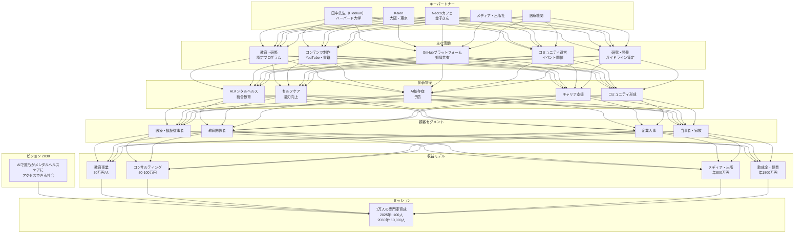
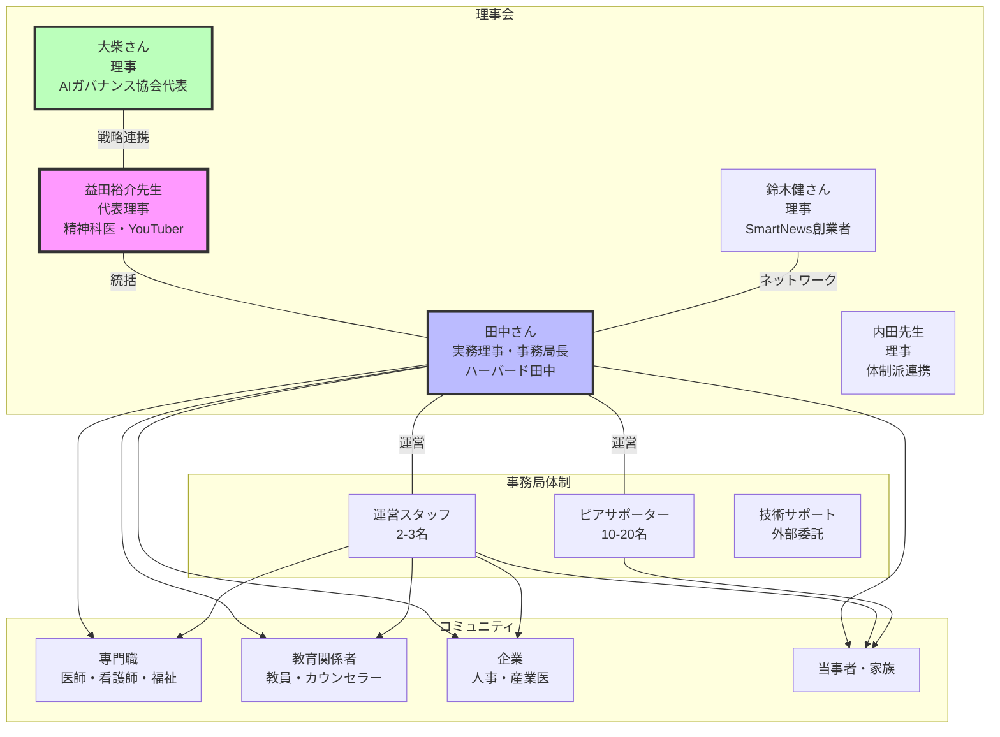
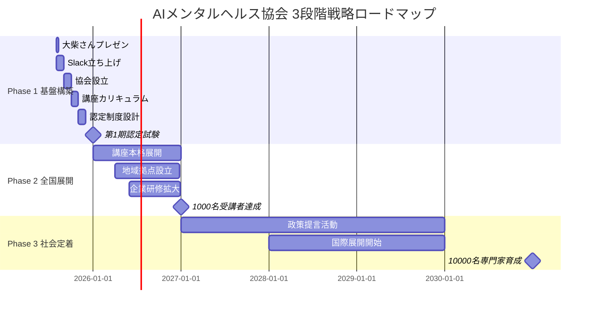
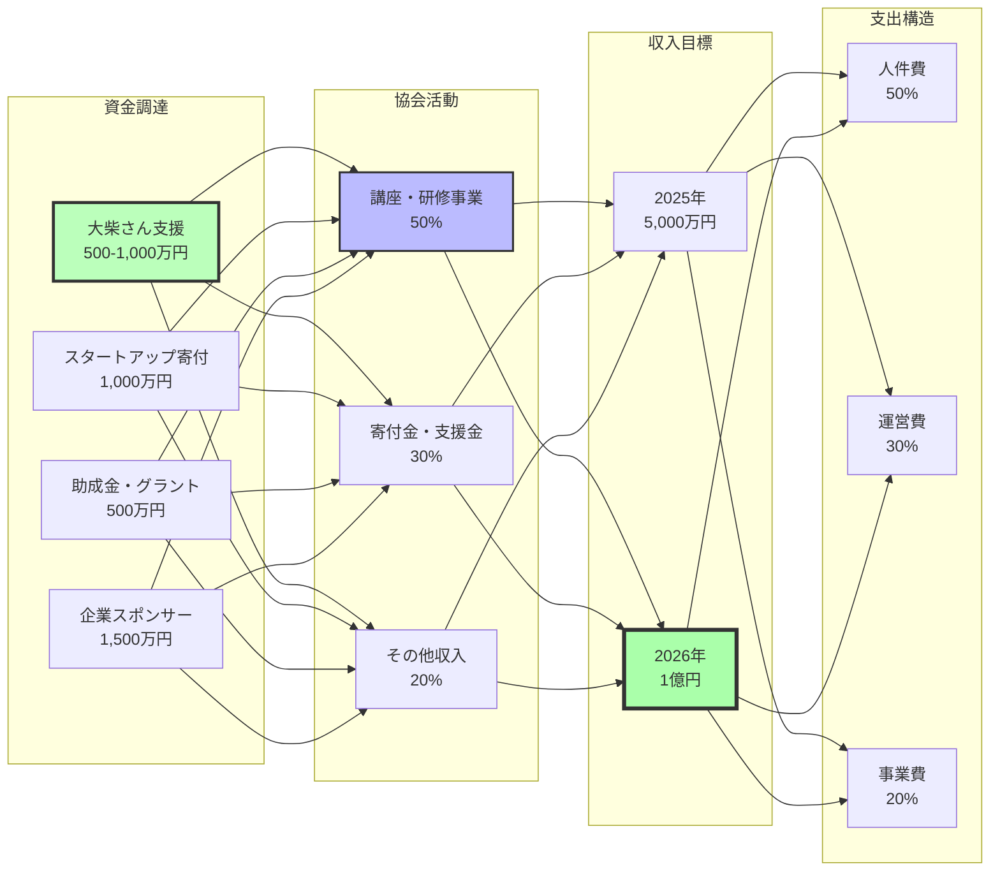
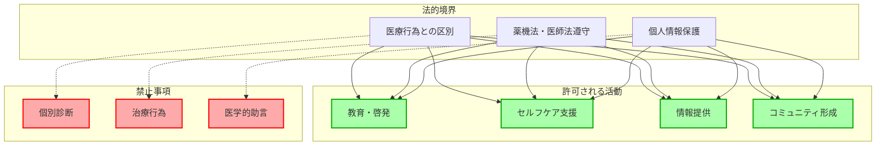
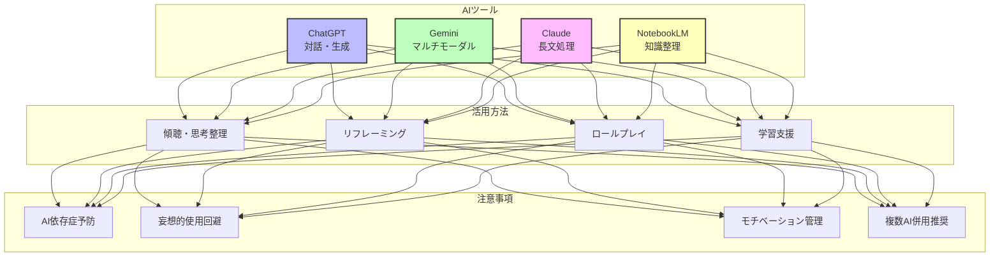

# AIメンタルヘルス統合戦略マスターファイル

作成日：2025年7月20日

---

# 目次

1. [概要](#概要)
2. [ビジョンと戦略](#ビジョンと戦略)
3. [ビジネスモデルキャンバス](#ビジネスモデルキャンバス)
4. [ステークホルダーエコシステム](#ステークホルダーエコシステム)
5. [実装計画](#実装計画)
6. [技術戦略](#技術戦略)
7. [コンテンツ戦略](#コンテンツ戦略)
8. [法的・倫理的考慮事項](#法的倫理的考慮事項)
9. [ビジネスモデルビジュアル図](#ビジネスモデルビジュアル図)

---

# 概要

## プロジェクト概要
AIとメンタルヘルスを融合させた革新的な教育・支援システムの構築を目指す戦略的イニシアチブ。2030年のAGI（汎用人工知能）時代を見据え、専門知識を持つ人材の大規模育成と、社会全体のメンタルヘルスリテラシー向上を図る。

## ビジョン
「AIの力で、誰もがメンタルヘルスケアにアクセスできる社会を実現する」

## ミッション
- AIとメンタルヘルスに精通した専門家1万人の育成（2030年目標）
- 法的・倫理的に適切なAI活用ガイドラインの確立
- 持続可能なコミュニティと教育システムの構築

## 主要参加者と役割
- **益田裕介先生**：プロジェクト全体統括、専門知識提供、コンテンツ監修
- **ともやさん（TOMOYA）**：技術開発リード、GitHub管理、Neccoカフェ連携、コミュニティ運営、イベント企画

## 主要登場人物と役割
- **田中先生（ハーバード田中、ニックネーム：Hidekun）**：カリキュラム開発、学術的権威、ネットワーク構築
- **編集・ライターチーム**：書籍出版プロジェクト推進

---

# ビジョンと戦略

## 2030年ビジョン

### AGI時代のメンタルヘルス教育

#### 背景と必要性
- 2030年のAGI完成を見据えた準備
- メンタルヘルス課題の社会的重要性の高まり
- AI技術の急速な進化に対応できる人材の不足

#### 育成目標
**段階的成長計画**
- 2025年：100名の専門家育成
- 2027年：1,000名規模への拡大
- 2030年：10,000名の目標達成

#### 対象者層
1. **医療・福祉従事者**
   - 精神科医、内科医
   - 看護師、保健師
   - 福祉関係者、ケースワーカー

2. **教育関係者**
   - 学校教員
   - スクールカウンセラー
   - 教育管理者

3. **企業・組織**
   - 人事担当者
   - 産業医・産業保健スタッフ
   - 管理職

4. **当事者・家族**
   - 患者本人
   - 家族・介護者
   - ピアサポーター

## AIメンタルヘルス協会の組織構想

### 協会設立の目的

#### 社会的使命
1. **教育・啓蒙活動**
   - 「科学的な心の見方」の普及
   - エビデンスベースのメンタルヘルス教育
   - AI活用リテラシーの向上

2. **信頼性と権威の確立**
   - 医学的根拠に基づく活動
   - AIガバナンス協会との戦略的連携
   - スタートアップ界隈からの支援

3. **コミュニティ形成**
   - Slackコミュニティの運営
   - Neccoカフェとの統合的運営
   - 実践者ネットワークの構築

### 資格認定制度

#### 認定レベル
1. **ベーシック認定**：基礎知識習得者
2. **アドバンス認定**：実践スキル習得者
3. **エキスパート認定**：指導・相談対応可能者
4. **マスター認定**：講師・トレーナー資格

#### 認定プロセス
- 段階的な講座プログラム
- 実践課題とケーススタディ
- 認定試験の実施
- 継続的な学習・研鑽

---

# ビジネスモデルキャンバス

## 🔗 キーパートナー (Key Partners)
- **大柴さん（AIガバナンス協会代表理事）**
  - 戦略的パートナーシップ
  - スタートアップ界隈への接続
  - AI分野での権威性
- **田中さん（ハーバード田中）**
  - 事務局長として実務推進
  - 運営統括・企画立案
  - 実行力とスピード感
- **Neccoカフェ（金子さん）**
  - 当事者コミュニティ運営
  - リアルな場の提供
  - 統合的運営パートナー
- **スタートアップ界隈**
  - 鈴木健さん（SmartNews創業者）
  - メルカリ創業者・幹部
  - VCパートナー・エンジェル投資家
- **医療・教育機関ネットワーク**
  - 精神科・内科連携
  - 教育委員会・学校現場
  - 企業人事・産業医

## ✅ 主な活動 (Key Activities)
- **コミュニティ運営**
  - オンライン・オフラインコミュニティの管理
  - メンバー間の交流促進
  - 月次イベント開催
- **講義とワークショップ（2025年5月から本格開始）**
  - Kaienやリワーク施設での実施
  - 体系的な教育プログラムの提供
  - 認定制度の運営
- **書籍出版（2025年11月予定）**
  - 専門知識の体系化
  - 一般向けコンテンツの制作
  - 複数出版社との連携
- **AI活用支援・教育**
  - AI活用方法の指導
  - セルフケアプログラム開発
  - 依存症予防ガイドライン策定
- **論文・講演・メディア出演**
  - 学術的権威の確立
  - 専門コミュニティでの発信
  - 一般向け啓発活動
- **GitHubプラットフォーム構築**
  - 知識のWikipedia化
  - オープンソース化
  - コミュニティ協働
  - （ともやさん主導）

## 🛠️ 主なリソース (Key Resources)
- **AI技術基盤**
  - LLM（ChatGPT、Gemini、Claude）
  - NotebookLM（知識整理）
  - 音声認識・文字起こし技術
- **知的資産**
  - 益田先生の専門知識（精神医学）
  - YouTube運営ノウハウ（50万人チャンネル）
  - AI活用事例データベース
- **プラットフォーム**
  - GitHubリポジトリ
  - 学習管理システム（LMS）
  - コミュニティポータル
- **人的資源**
  - 専門家ネットワーク
  - 認定講師陣
  - ボランティアサポーター
- **物理的拠点**
  - 早稲田メンタルクリニック
  - Neccoカフェ
  - 提携施設

## 🎁 価値提案 (Value Propositions)
- **AIとメンタルヘルスの統合教育**
  - 体系的な知識習得
  - 実践的なスキル向上
  - 認定資格の付与
- **セルフケア能力の向上**
  - 傾聴と思考整理の技術
  - リフレーミング手法
  - ロールプレイによる練習
- **AI依存症・誤用の予防**
  - 健全な利用ガイドライン
  - リスク管理教育
  - モチベーション管理
- **キャリア支援**
  - AI時代の働き方理解
  - 転職・就労支援
  - スキルアップ機会
- **コミュニティ形成**
  - 専門家ネットワーク
  - ピアサポート
  - 継続的な学習環境

## ❤️ 顧客との関係 (Customer Relationships)
- **個別対応**
  - 専門的な質問への回答
  - 個別相談サービス
  - メンタリング
- **コミュニティ交流**
  - YouTubeライブ（オンライン/オフライン）
  - リアルタイムQ&A
  - フォーラム・掲示板
- **継続的サポート**
  - 定期的なフォローアップ
  - アップデート情報提供
  - 生涯学習支援

## 📺 チャネル (Channels)
- **デジタルチャネル**
  - YouTube（メイン・ショート動画）
  - ポッドキャスト
  - note.com
  - 独自ブログ
  - SNS（X、Instagram）
- **物理チャネル**
  - リワーク病院・施設
  - 自助会・家族会
  - Neccoカフェ
  - 学会・カンファレンス
- **パートナーチャネル**
  - Kaien施設
  - 医療機関
  - 教育機関
  - 企業研修
- **メディア**
  - テレビ・ラジオ出演
  - 新聞・雑誌寄稿
  - オンラインメディア

## 👥 顧客セグメント (Customer Segments)
### プライマリーターゲット
- **AIメンタルヘルス専門家志望者（1万人目標）**
  - 2025年：100人
  - 2027年：1,000人
  - 2030年：10,000人

### セグメント別ターゲット
- **医療・福祉従事者**
  - 精神科医・内科医
  - 看護師・保健師
  - 福祉職・ケースワーカー
- **教育関係者**
  - 学校教員
  - スクールカウンセラー
  - 教育管理者
- **企業関係者**
  - 人事担当者
  - 産業医・産業保健スタッフ
  - 管理職・経営者
- **当事者・家族**
  - メンタル不調の当事者
  - 発達障害の当事者
  - 家族・介護者

## 💰 コスト構造 (Cost Structure)
### 人件費（50%）
- **事務局運営**: 年間3,000万円
  - 事務局長（田中さん）: 600万円
  - 運営スタッフ（3名）: 1,200万円
  - 外部講師謝金: 700万円
  - 技術アドバイザー（ともや）: 200万円
  - 諮問委員・理事謝金: 300万円

### 運営費（30%）
- **オフィス・施設費**: 年間600万円
  - シェアオフィス・会議室
  - セミナー会場費
- **システム・IT費**: 年間800万円
  - プラットフォーム開発・保守
  - AIサービス利用料
  - ツール・ソフトウェア
- **マーケティング・広報費**: 年間800万円
  - デジタル広告
  - イベント・セミナー
  - PR・メディア対応

### 事業費（20%）
- **講座・教材開発費**: 年間800万円
  - カリキュラム開発
  - 動画・教材制作
  - 認定制度運営
- **調査・研究費**: 年間400万円
  - 実証研究
  - 効果測定
- **イベント開催費**: 年間375万円

### 年間支出規模
- 初年度（2025年）: 5,000万円
- 2年目以降: 7,500万円（利益率25%目標）

## 💵 収入の流れ (Revenue Streams)
### 講座・研修収入（50%）
- **個人向け講座**: 年間2,000万円
  - 基礎講座: 月20名×2万円×12ヶ月
  - 実践講座: 月10名×5万円×12ヶ月
  - 専門講座: 月5名×8万円×12ヶ月
- **企業向け研修**: 年間2,500万円
  - 管理職研修: 月5回×50万円×12ヶ月
  - 人事担当者研修: 月3回×30万円×12ヶ月
  - カスタム研修: 年間10回×100万円
- **認定・資格収入**: 年間500万円
  - 認定試験料: 年間250名×2万円
  - 資格更新料: 年間500名×1万円

### 寄付金・支援金（30%）
- **個人寄付**: 年間1,000万円
  - 少額寄付: 月500名×平均5,000円×12ヶ月
  - 高額寄付: 年間10名×平均50万円
- **企業寄付**: 年間1,500万円
  - スタートアップ寄付: 年間15社×50万円
  - 大手企業寄付: 年間5社×200万円
  - 協賛・スポンサーシップ: 年間500万円
- **助成金・グラント**: 年間500万円
  - 政府系助成金: 年間2-3件
  - 民間財団助成金: 年間1-2件

### その他収入（20%）
- **コンサルティング収入**: 年間1,000万円
- **出版・メディア収入**: 年間500万円
- **イベント・セミナー収入**: 年間300万円
- **ライセンス・知財収入**: 年間200万円

### 年間収入目標
- 初年度（2025年）: 5,000万円
- 2年目（2026年）: 1億円（収支均衡）

## 💰 資金調達戦略

### 大柴さんネットワーク活用
- **AIガバナンス協会代表理事としての影響力**
  - スタートアップ界隈への強力なコネクション
  - 初期支援目標: 500-1,000万円
  - 連携事業による継続的支援
  
### スタートアップ界隈からの支援
- **ターゲット層**
  - 鈴木健さん（SmartNews創業者）
  - メルカリ創業者・幹部
  - B2B SaaS創業者
  - ヘルステック起業家
- **価値提案**
  - 社会的インパクト投資機会
  - 企業CSR・ESG投資との整合性
  - 税制優遇措置の活用

### 従来型資金調達
- **助成金・グラント**
  - 厚生労働省（職場メンタルヘルス）
  - 文部科学省（教育イノベーション）
  - 民間財団（日本財団、トヨタ財団等）
- **企業スポンサーシップ**
  - メンタルヘルステック企業
  - HR・人事系SaaS企業
  - 製薬会社（精神科領域）

### 段階的調達計画
- **Phase 1（2025年8-10月）**: 2,000万円
  - 大柴さん支援: 500万円
  - スタートアップ寄付: 1,000万円
  - 助成金申請: 500万円
- **Phase 2（2026年）**: 3,000万円
  - 企業スポンサー拡大
  - 継続的寄付基盤確立
- **Phase 3（2027年以降）**: 自立的運営
  - 講座・研修収入中心
  - 寄付金30%以下に抑制

## 📊 KPI（重要業績評価指標）
- **認定者数**: 2025年100人 → 2030年10,000人
- **月間アクティブユーザー**: 10,000人（2025年末）
- **コンテンツ閲覧数**: 月間100万PV
- **企業パートナー数**: 50社（2025年末）
- **満足度**: 90%以上

## 🎓 教育事業の詳細

### プログラム体系

#### 基礎レベル（20時間）
- **AIセルフケア入門**（一般向け）
  - AI基礎知識とメンタルヘルスへの応用
  - セルフケアツールの使い方
  - プライバシー・倫理的配慮
- **心理学・精神医学基礎**（教育関係者向け）
  - 基本的な心理学理論
  - 発達段階とメンタルヘルス
  - 学校現場での対応方法
- **メンタルヘルス対応基礎**（企業向け）
  - 職場のメンタルヘルス概論
  - ストレスマネジメント
  - 早期発見・対応の基本

#### 実践レベル（40時間）
- **教室でのAIセルフケア実践**（教師向け）
  - 生徒向けAIツールの導入方法
  - 保護者との連携
  - 実践事例とケーススタディ
- **職場でのメンタルヘルス対応**（人事・管理職向け）
  - AIを活用した従業員サポート
  - リモートワーク時代の課題対応
  - 組織的なウェルビーイング向上
- **AI活用カウンセリング手法**（専門職向け）
  - AIツールとの効果的な併用
  - エビデンスベースの実践
  - 倫理的ガイドライン

#### 指導者レベル（60時間）
- **認定講師養成プログラム**
  - 教授法・ファシリテーション
  - カリキュラム開発
  - 品質管理と評価
- **トレーナー・オブ・トレーナー研修**
  - 組織内展開の方法
  - 研修効果の測定
  - 継続的改善プロセス

### 認定制度

#### 資格レベル
1. **ベーシック認定**
   - 基礎講座修了 + オンライン試験
   - 更新: 年1回の研修参加
2. **アドバンス認定**
   - 実践講座修了 + ケーススタディ発表
   - 更新: 年20時間の継続学習
3. **エキスパート認定**
   - 専門講座修了 + 実践証明
   - 更新: 年間指導実績 + 研究発表
4. **マスター認定**
   - 講師養成修了 + 審査合格
   - 更新: 講師活動 + 品質評価

### 品質保証体制
- **医学的監修**: 益田先生による全カリキュラムチェック
- **外部評価**: 第三者機関による定期評価
- **受講者フィードバック**: 満足度調査と改善
- **継続的更新**: 最新知見の反映（3ヶ月ごと）

---

# ステークホルダーエコシステム

## 👥 支援者・協力者

### コアメンバー
- **益田裕介先生（精神科医・YouTuber）**
  - プロジェクト全体統括
  - 精神医学の専門知識提供
  - YouTube（70万人チャンネル）での発信力
  - メディア戦略の統括

- **ハーバード田中（ニックネーム：Hidekun）**
  - カリキュラム開発主導
  - 国際連携の推進
  - 学術的権威の提供
  - AI研究の最新動向共有
  - 天才エンジニア集団とのネットワーク

- **ともやさん（技術開発・コミュニティ運営）**
  - GitHub管理・プラットフォーム構築
  - Neccoカフェとの連携調整
  - コミュニティ運営・イベント企画
  - 発達障害当事者視点での企画
  - ADHD特性を活かした効率化ツール開発

- **みーちゃん（ともやさんのパートナー）**
  - AI活用による作業効率化担当
  - コンテンツ制作サポート
  - 事務局運営支援

### 外部パートナー
- **金子さん（Neccoカフェオーナー）**
  - 当事者コミュニティとの連携
  - リアルな場での実践機会提供
  - イベント会場の提供(東京都新宿区西早稲田)
  - 発達障害当事者協会 副理事
  - 発達障害者就労支援のノウハウ

- **Kaien（大阪・東京）**
  - 発達障害者支援の実績
  - 既存施設・プログラムの活用
  - リワーク事業での実践

- **編集・ライターチーム**
  - 書籍執筆・編集
  - コンテンツの一般化
  - メディア展開サポート

## 🎯 主な活動

### 情報関連
- **情報収集**
  - AI・メンタルヘルス関連の最新動向
  - 海外事例の調査（特に英語圏）
  - 法規制・倫理ガイドラインの把握
  - 競合サービスの分析

- **コンテンツ作成**
  - YouTube動画制作（メイン・ショート）
  - ポッドキャスト収録
  - 書籍・記事執筆
  - 講義資料・教材開発
  - GitHubドキュメント作成

- **情報発信**
  - SNSでの日常的発信（X、Instagram）
  - メディア出演（TV、ラジオ、雑誌）
  - 講演・ワークショップ開催
  - ニュースレター配信
  - 学会発表

### コミュニティ活動
- **教育・研修**
  - 認定プログラムの運営
  - ワークショップ開催（月2回）
  - オンライン講座の提供
  - 個別メンタリング

- **ネットワーキング**
  - 専門家コミュニティの形成
  - 自助会・家族会との連携
  - 企業との協力関係構築
  - 国際的なネットワーク形成

- **実践・検証**
  - AI活用事例の収集・分析
  - 効果測定・改善
  - ベストプラクティスの共有
  - ガイドライン策定

## 📦 どのように役に立つか

### 社会的価値
- **AIメンタルヘルスの普及**
  - 正しい知識の啓発
  - 実践的な活用方法の提供
  - リスク管理の周知

- **専門家育成**
  - 体系的な教育プログラム
  - 認定制度による質保証
  - 継続的な学習機会

- **アクセシビリティ向上**
  - 地理的制約の解消
  - 経済的負担の軽減
  - 24時間365日のサポート

### 個人的価値
- **当事者・家族への支援**
  - セルフケア能力の向上
  - 孤立感の解消
  - エンパワーメント

- **専門職のスキルアップ**
  - AI活用スキルの習得
  - 効率的な支援方法の学習
  - キャリアアップ機会

- **企業・組織への貢献**
  - 職場メンタルヘルスの改善
  - 生産性の向上
  - 離職率の低下

## 💬 コミュニケーションの取り方

### 対面・リアル
- **定期ミーティング**
  - 週次オンラインミーティング
  - 月次対面ミーティング
  - 四半期レビュー

- **イベント・ワークショップ**
  - Neccoカフェでの交流会
  - 研修・セミナー
  - カンファレンス参加

### デジタルコミュニケーション
- **即時性の高いツール**
  - Slack（プロジェクト管理）

- **協働プラットフォーム**
  - GitHub（ドキュメント管理）
  - Google Drive（資料共有）

- **公開コミュニケーション**
  - X（Twitter）での発信
  - YouTubeコメント欄
  - ブログ・note記事

### メディアプラットフォーム
- **動画・音声**
  - YouTube（メイン・ライブ）
  - ポッドキャスト
  - Instagram Reels/Stories

- **テキストコンテンツ**
  - note.com（詳細記事）
  - 独自ブログ（SEO対策）

## 💸 投資と期待リターン

### 時間投資
- **コアメンバー**
  - フルタイム相当（週40時間）
  - 夜間・週末の活動
  - 継続的なコミットメント

- **協力者**
  - プロジェクトベース
  - イベント参加
  - オンライン貢献

### 金銭投資
- **個人投資**
  - AIサービス利用料（月1-2万円）
  - 書籍・教材購入
  - イベント参加費
  - 機材・ツール

- **組織投資**
  - システム開発費
  - マーケティング費用
  - 人件費
  - 施設・設備費

### 期待リターン

#### 経済的リターン
- **直接収入**
  - 講師料・コンサルフィー
  - 書籍印税
  - YouTube収益
  - 認定プログラム収入

- **間接収入**
  - キャリアアップ
  - ネットワーク拡大
  - ブランド価値向上

#### 社会的リターン
- **影響力**
  - 1万人の専門家育成
  - 社会課題の解決
  - 政策への影響

- **個人的充実**
  - 自己実現
  - 社会貢献の実感
  - 専門性の向上
  - コミュニティの形成

---

# 実装計画

## Phase 1: 基盤構築（2025年8月-12月）

### 8月
- [ ] 大柴さん（AIガバナンス協会代表理事）へのプレゼン実施
- [ ] Slackコミュニティ立ち上げ（初期100名目標）
- [ ] 協会設立準備開始

### 9月
- [ ] AIメンタルヘルス協会正式設立
- [ ] 理事体制確立（益田先生、田中さん、大柴さん、鈴木健さん、内田先生）
- [ ] 初期メンバー100名獲得

### 10月
- [ ] 初回講座カリキュラム完成
- [ ] パイロット講座3回実施
- [ ] AIガバナンス協会との連携協定締結
- [ ] AI誘発精神病部門設置

### 11月
- [ ] 認定制度設計完了
- [ ] 講師養成プログラム開始
- [ ] Webサイト・システム構築

### 12月
- [ ] 第1期認定資格試験実施
- [ ] 年間活動報告・次年度計画策定
- [ ] Phase 2準備開始

## Phase 2: 全国展開（2026年1月-12月）

### 目標
- 年間受講者1,000名
- 認定資格者100名
- 全国20地域での講座実施
- 講座・研修収入5,000万円達成

### 主要施策
- **教育事業の拡大**
  - 基礎・実践・専門講座の本格展開
  - 企業向け研修プログラムの強化
  - オンライン学習プラットフォーム構築
- **地域展開**
  - 主要都市でのサテライト拠点設置
  - 地域パートナーとの提携
  - 認定講師の育成（50名目標）
- **収益基盤の確立**
  - 月間収入1,000万円の安定化
  - 企業スポンサーシップ獲得
  - 助成金・グラント申請

## Phase 3: 社会定着（2027年以降）

### 長期ビジョン
- **2027年目標**
  - 年間収入1.5億円
  - 認定者数2,000名
  - 政策提言への参画
- **2030年目標**
  - AIメンタルヘルス専門家10,000名育成
  - 国際基準策定への参画
  - 次世代人材育成システム確立

### 戦略的取り組み
- **社会的インパクトの拡大**
  - 政府・文科省への政策提言
  - 学術研究・論文発表
  - メディア露出の増加
- **国際展開**
  - 英語版プログラムの開発
  - アジア圏への展開
  - 国際会議での発表
- **持続可能性の確保**
  - 自立的な運営体制
  - 次世代リーダー育成
  - イノベーション基金設立

---

# 技術戦略

## GitHubを活用した知識共有

### リポジトリ構造
```
ai-mental-health-wiki/
├── docs/
│   ├── fundamentals/      # 基礎知識
│   ├── case-studies/      # 事例集
│   ├── tools/            # ツール活用法
│   └── guidelines/       # ガイドライン
├── examples/             # コード例
├── resources/           # リソース集
└── community/          # コミュニティ情報
```

### コントリビューション方針
- オープンソースでの知識共有
- peer reviewプロセスの導入
- 定期的なドキュメント更新

## AIツールの活用戦略

### 主要ツールと用途
1. **ChatGPT**
   - 対話型サポート
   - コンテンツ生成
   - 学習支援

2. **Gemini**
   - マルチモーダル処理
   - 音声入力活用
   - コンテキスト理解

3. **Claude**
   - 長文処理
   - 専門的分析
   - 倫理的配慮

4. **NotebookLM**
   - 知識整理
   - 研究支援
   - 協働作業

---

# コンテンツ戦略

## ワークショップ・講義計画

### 定期開催プログラム
- **入門編**：月1回（オンライン）
- **実践編**：月2回（ハイブリッド）
- **指導者養成**：四半期1回

### 特別イベント
- AI活用デモンストレーション
- 事例発表会
- ネットワーキングセッション

---

# 法的・倫理的考慮事項

## 医療行為との境界線

### 明確な区分
1. **可能な活動**
   - 教育・啓発活動
   - セルフケア支援
   - 情報提供

2. **避けるべき活動**
   - 個別診断
   - 治療行為
   - 医学的助言

### 法的リスク管理
- 薬機法・医師法の遵守
- 利用規約の明確化
- 免責事項の設定

## AI活用ガイドライン

### 適切な利用方法
1. **傾聴と思考整理**
   - 感情の言語化支援
   - 問題の構造化
   - 気づきの促進

2. **リフレーミング**
   - 多角的視点の提供
   - 認知の柔軟化
   - ポジティブな解釈

3. **ロールプレイ**
   - 対人スキル練習
   - シミュレーション
   - 自己理解促進

4. **学習支援**
   - 個別化された教育
   - 理解度に応じた説明
   - 継続的なサポート

## 依存症防止策

### リスク評価
- 過度な依存の兆候チェック
- 現実逃避的使用の監視
- 妄想的思考の早期発見

### 予防措置
1. **利用時間の管理**
2. **複数AIツールの併用推奨**
3. **人間関係の維持強調**
4. **定期的な振り返り**

---

# ビジネスモデルビジュアル図

## プロジェクト全体構造



## ステークホルダー関係図



## 成長戦略タイムライン



## 収益構造フロー



## 法的・倫理的フレームワーク



## AIツール活用エコシステム



---

## アクションアイテムと役割分担

### 益田裕介ドクター
- [ ] AIセルフケア教材の監修（継続）
- [ ] GitHubコンテンツの作成（継続）
- [ ] メディア戦略の統括（継続）
- [ ] カリキュラム開発主導（Q1 2025）


### Neccoカフェ ともやさん（TOMOYA）
### コンテンツ制作

- [ ] ショート動画・ポッドキャスト制作（継続）
- [ ] ワークショップ企画・運営（継続）
- [ ] 日本語AI事例コンテンツ制作（週次）
- [ ] ニュースレター配信（月次）
- [ ] コミュニティイベント開催（月次）
- [ ] GitHubリポジトリ構築（Q1 2025）
- [ ] 技術プラットフォーム開発（Q2 2025）


### ハーバード田中（Hidekun）
- [ ] 国際連携の推進（継続）
- [ ] ネットワーク活用した人材確保（Q3 2025）

### 顧問弁護士
- [ ] 法的コンプライアンス監督（Q2 2025）


---

## 重要な洞察と今後の展望

### 社会課題への貢献
多くの社会問題（少子化、貧困、教育格差等）の根底にあるメンタルヘルス課題に対し、AIを活用した包括的アプローチで解決を図る。単なる技術導入ではなく、人間中心のコミュニティ形成が鍵となる。

### エンジニアとの親和性
プログラミングと精神医学の思考プロセスには共通点が多く、エンジニアコミュニティとの連携により、技術的イノベーションと実践的応用の両立が可能。

### 人間の役割の再定義
AIが知識提供を担う一方、モチベーション付け、コミュニティ形成、倫理的判断など、人間にしかできない役割の重要性がより明確になる。これらの要素を統合した新しい支援モデルの構築が必要。

### 持続可能な成長
急速な拡大よりも、質の高い教育と着実なコミュニティ形成を重視。10年間という長期視点で、社会に根付いた持続可能なシステムを構築する。

---

**文書作成日**：2025年7月20日  
**文書作成者**：ともや  
**最終更新**：2025年8月2日（更新）
