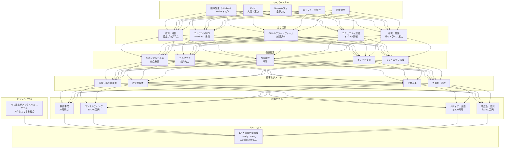
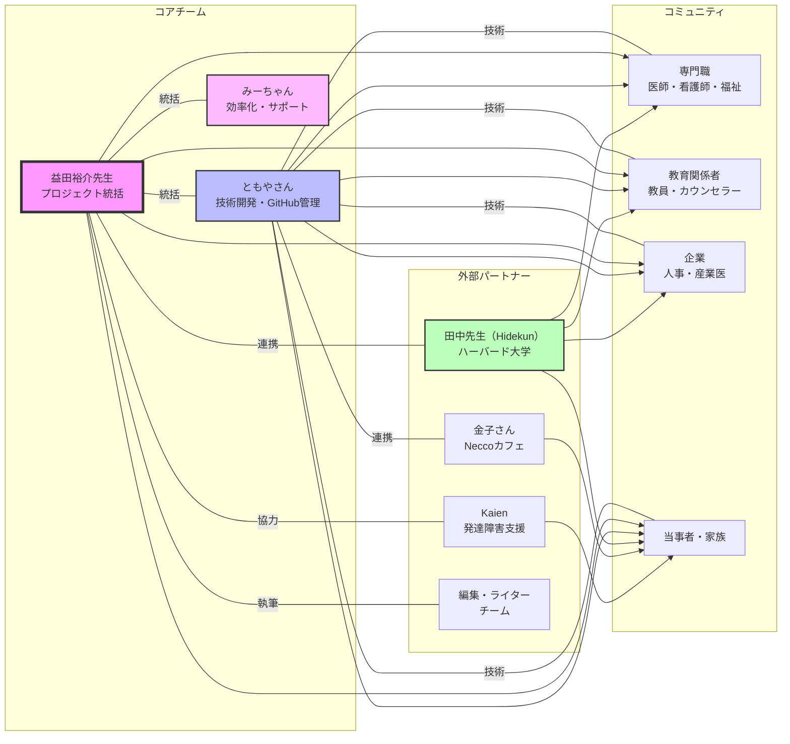
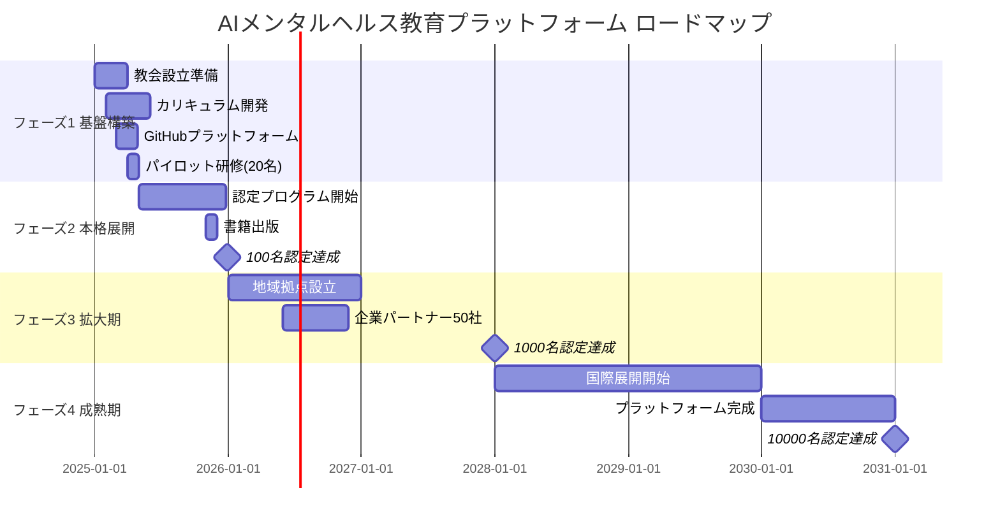
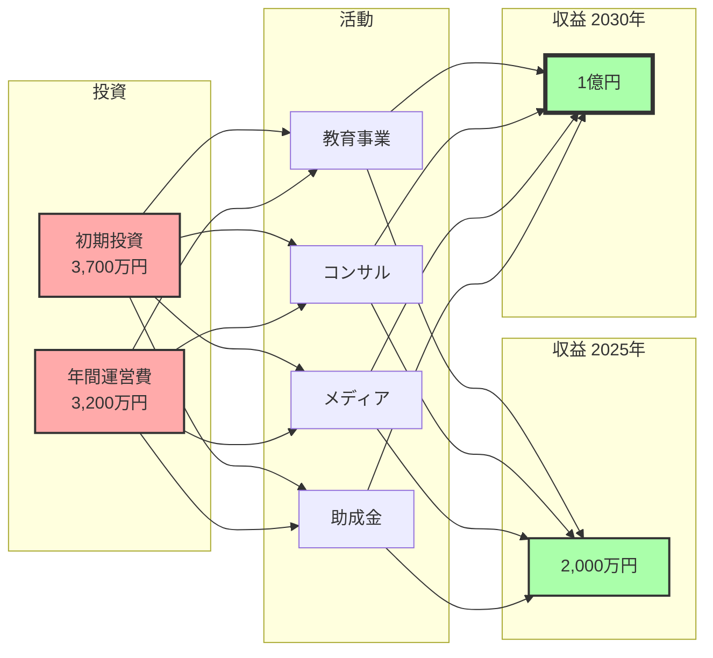
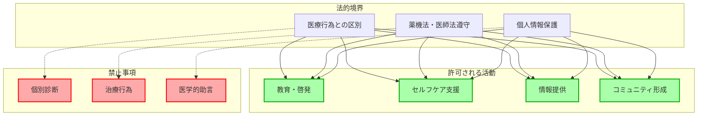
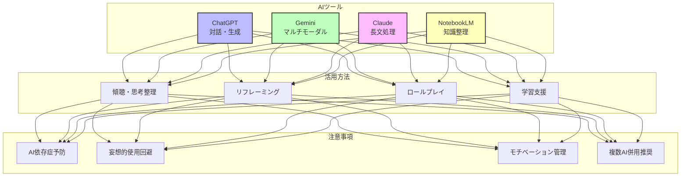

# AIメンタルヘルス統合戦略マスターファイル

作成日：2025年7月20日

---

# 目次

1. [概要](#概要)
2. [ビジョンと戦略](#ビジョンと戦略)
3. [ビジネスモデルキャンバス](#ビジネスモデルキャンバス)
4. [ステークホルダーエコシステム](#ステークホルダーエコシステム)
5. [実装計画](#実装計画)
6. [技術戦略](#技術戦略)
7. [コンテンツ戦略](#コンテンツ戦略)
8. [法的・倫理的考慮事項](#法的倫理的考慮事項)
9. [ビジネスモデルビジュアル図](#ビジネスモデルビジュアル図)

---

# 概要

## プロジェクト概要
AIとメンタルヘルスを融合させた革新的な教育・支援システムの構築を目指す戦略的イニシアチブ。2030年のAGI（汎用人工知能）時代を見据え、専門知識を持つ人材の大規模育成と、社会全体のメンタルヘルスリテラシー向上を図る。

## ビジョン
「AIの力で、誰もがメンタルヘルスケアにアクセスできる社会を実現する」

## ミッション
- AIとメンタルヘルスに精通した専門家1万人の育成（2030年目標）
- 法的・倫理的に適切なAI活用ガイドラインの確立
- 持続可能なコミュニティと教育システムの構築

## 主要参加者と役割
- **益田裕介先生**：プロジェクト全体統括、専門知識提供、コンテンツ監修
- **ともやさん（TOMOYA）**：技術開発リード、GitHub管理、Neccoカフェ連携、コミュニティ運営、イベント企画

## 主要登場人物と役割
- **田中先生（ハーバード大学教授、ニックネーム：Hidekun）**：カリキュラム開発、学術的権威、ネットワーク構築
- **編集・ライターチーム**：書籍出版プロジェクト推進

---

# ビジョンと戦略

## 2030年ビジョン

### AGI時代のメンタルヘルス教育

#### 背景と必要性
- 2030年のAGI完成を見据えた準備
- メンタルヘルス課題の社会的重要性の高まり
- AI技術の急速な進化に対応できる人材の不足

#### 育成目標
**段階的成長計画**
- 2025年：100名の専門家育成
- 2027年：1,000名規模への拡大
- 2030年：10,000名の目標達成

#### 対象者層
1. **医療・福祉従事者**
   - 精神科医、内科医
   - 看護師、保健師
   - 福祉関係者、ケースワーカー

2. **教育関係者**
   - 学校教員
   - スクールカウンセラー
   - 教育管理者

3. **企業・組織**
   - 人事担当者
   - 産業医・産業保健スタッフ
   - 管理職

4. **当事者・家族**
   - 患者本人
   - 家族・介護者
   - ピアサポーター

## メンタルヘルス教会構想

### 組織の目的と意義

#### 設立目的
1. **知識の体系化と標準化**
   - AIメンタルヘルスケアの統一基準策定
   - ベストプラクティスの収集と共有
   - 継続的な研究開発

2. **信頼性と権威の確立**
   - メディア対応時の公式組織として機能
   - 企業・行政との連携窓口
   - 国際的な認知度向上

3. **コミュニティ形成**
   - 実践者ネットワークの構築
   - 相互学習とサポート体制
   - イノベーションの促進

### 資格認定制度

#### 認定レベル
1. **基礎レベル**：AIツールの基本的な活用
2. **実践レベル**：専門分野での応用
3. **指導者レベル**：教育・研修の実施能力

#### 認定プロセス
- オンライン学習プログラム
- 実践課題の提出
- 認定試験の実施
- 継続教育要件

---

# ビジネスモデルキャンバス

## 🔗 キーパートナー (Key Partners)
- **田中先生（ハーバード大学教授、ニックネーム：Hidekun）**
  - 学術的権威・カリキュラム開発
  - 人脈ネットワーク（天才エンジニア集団）
  - AI・メンタルヘルス統合の理論構築
- **Kaien（大阪・東京）**
  - 発達障害者支援のノウハウ
  - 既存コミュニティ基盤
  - リワーク事業での実践経験
- **マスコミ・メディア**
  - 情報発信チャネル
  - 権威性の構築
  - PR戦略サポート
- **Neccoカフェ（金子さん）**
  - 当事者コミュニティ運営
  - リアルな場の提供
  - イベント開催協力
- **医療機関ネットワーク**
  - 精神科・内科連携
  - リワーク病院
  - 産業医ネットワーク

## ✅ 主な活動 (Key Activities)
- **コミュニティ運営**
  - オンライン・オフラインコミュニティの管理
  - メンバー間の交流促進
  - 月次イベント開催
- **講義とワークショップ（2025年5月から本格開始）**
  - Kaienやリワーク施設での実施
  - 体系的な教育プログラムの提供
  - 認定制度の運営
- **書籍出版（2025年11月予定）**
  - 専門知識の体系化
  - 一般向けコンテンツの制作
  - 複数出版社との連携
- **AI活用支援・教育**
  - AI活用方法の指導
  - セルフケアプログラム開発
  - 依存症予防ガイドライン策定
- **論文・講演・メディア出演**
  - 学術的権威の確立
  - 専門コミュニティでの発信
  - 一般向け啓発活動
- **GitHubプラットフォーム構築**
  - 知識のWikipedia化
  - オープンソース化
  - コミュニティ協働
  - （ともやさん主導）

## 🛠️ 主なリソース (Key Resources)
- **AI技術基盤**
  - LLM（ChatGPT、Gemini、Claude）
  - NotebookLM（知識整理）
  - 音声認識・文字起こし技術
- **知的資産**
  - 益田先生の専門知識（精神医学）
  - YouTube運営ノウハウ（50万人チャンネル）
  - AI活用事例データベース
- **プラットフォーム**
  - GitHubリポジトリ
  - 学習管理システム（LMS）
  - コミュニティポータル
- **人的資源**
  - 専門家ネットワーク
  - 認定講師陣
  - ボランティアサポーター
- **物理的拠点**
  - 早稲田メンタルクリニック
  - Neccoカフェ
  - 提携施設

## 🎁 価値提案 (Value Propositions)
- **AIとメンタルヘルスの統合教育**
  - 体系的な知識習得
  - 実践的なスキル向上
  - 認定資格の付与
- **セルフケア能力の向上**
  - 傾聴と思考整理の技術
  - リフレーミング手法
  - ロールプレイによる練習
- **AI依存症・誤用の予防**
  - 健全な利用ガイドライン
  - リスク管理教育
  - モチベーション管理
- **キャリア支援**
  - AI時代の働き方理解
  - 転職・就労支援
  - スキルアップ機会
- **コミュニティ形成**
  - 専門家ネットワーク
  - ピアサポート
  - 継続的な学習環境

## ❤️ 顧客との関係 (Customer Relationships)
- **個別対応**
  - 専門的な質問への回答
  - 個別相談サービス
  - メンタリング
- **コミュニティ交流**
  - YouTubeライブ（オンライン/オフライン）
  - リアルタイムQ&A
  - フォーラム・掲示板
- **継続的サポート**
  - 定期的なフォローアップ
  - アップデート情報提供
  - 生涯学習支援

## 📺 チャネル (Channels)
- **デジタルチャネル**
  - YouTube（メイン・ショート動画）
  - ポッドキャスト
  - note.com
  - 独自ブログ
  - SNS（X、Instagram）
- **物理チャネル**
  - リワーク病院・施設
  - 自助会・家族会
  - Neccoカフェ
  - 学会・カンファレンス
- **パートナーチャネル**
  - Kaien施設
  - 医療機関
  - 教育機関
  - 企業研修
- **メディア**
  - テレビ・ラジオ出演
  - 新聞・雑誌寄稿
  - オンラインメディア

## 👥 顧客セグメント (Customer Segments)
### プライマリーターゲット
- **AIメンタルヘルス専門家志望者（1万人目標）**
  - 2025年：100人
  - 2027年：1,000人
  - 2030年：10,000人

### セグメント別ターゲット
- **医療・福祉従事者**
  - 精神科医・内科医
  - 看護師・保健師
  - 福祉職・ケースワーカー
- **教育関係者**
  - 学校教員
  - スクールカウンセラー
  - 教育管理者
- **企業関係者**
  - 人事担当者
  - 産業医・産業保健スタッフ
  - 管理職・経営者
- **当事者・家族**
  - メンタル不調の当事者
  - 発達障害の当事者
  - 家族・介護者

## 💰 コスト構造 (Cost Structure)
### 初期投資（2025年）
- **システム開発費**: 500万円
  - LMS構築
  - プラットフォーム開発
  - GitHubリポジトリ整備

### 運営費（年間）
- **人件費**: 2,000万円
  - 専任スタッフ（3名）
  - 講師謝礼
  - 事務局運営
- **技術インフラ**: 200万円
  - AIサービス利用料
  - サーバー・ホスティング
  - ツールライセンス
- **コンテンツ制作**: 500万円
  - 動画制作
  - 教材開発
  - 翻訳・ローカライズ
- **マーケティング**: 300万円
  - 広告宣伝
  - イベント開催
  - PR活動
- **施設・会場費**: 200万円
  - セミナー会場
  - ワークショップ開催
  - 機材レンタル

### 総コスト見込み
- 2025年：3,700万円
- 2026年以降：3,200万円/年

## 💵 収入の流れ (Revenue Streams)
### 教育事業
- **認定プログラム**: 30万円/人
  - 基礎コース：10万円
  - 実践コース：10万円
  - 指導者コース：10万円
- **ワークショップ**: 1万円/回
  - 月2回開催
  - 定員30名
- **オンラインコース**: 5万円/人
  - 自己学習型
  - 動画・教材付き

### コンサルティング事業
- **企業研修**: 50万円/回
  - カスタマイズ研修
  - 継続サポート付き
- **アプリ監修**: 100万円/件
  - メンタルヘルスアプリ
  - AI活用ツール
- **顧問契約**: 30万円/月
  - 定期的なアドバイス
  - 優先サポート

### メディア・出版事業
- **書籍印税**: 500万円/年
  - 複数タイトル展開
  - 電子書籍含む
- **YouTube収益**: 300万円/年
  - 広告収入
  - スーパーチャット
  - メンバーシップ
- **講演料**: 30万円/回
  - 年間20回想定

### 助成金・協賛
- **企業スポンサー**: 1,000万円/年
  - 年間パートナー契約
  - イベント協賛
- **政府助成金**: 500万円/年
  - 研究開発補助
  - 社会課題解決支援
- **クラウドファンディング**: 300万円
  - プロジェクト単位

### 収益見込み
- 2025年：2,000万円
- 2026年：4,000万円
- 2027年：6,000万円
- 2030年：1億円

## 📊 KPI（重要業績評価指標）
- **認定者数**: 2025年100人 → 2030年10,000人
- **月間アクティブユーザー**: 10,000人（2025年末）
- **コンテンツ閲覧数**: 月間100万PV
- **企業パートナー数**: 50社（2025年末）
- **満足度**: 90%以上

---

# ステークホルダーエコシステム

## 👥 支援者・協力者

### コアメンバー
- **益田裕介先生（精神科医・YouTuber）**
  - プロジェクト全体統括
  - 精神医学の専門知識提供
  - YouTube（50万人チャンネル）での発信力
  - メディア戦略の統括

- **田中先生（ハーバード大学教授、ニックネーム：Hidekun）**
  - カリキュラム開発主導
  - 国際連携の推進
  - 学術的権威の提供
  - AI研究の最新動向共有
  - 天才エンジニア集団とのネットワーク

- **ともやさん（技術開発・コミュニティ運営）**
  - 技術開発リード
  - GitHub管理・プラットフォーム構築
  - Neccoカフェとの連携調整
  - コミュニティ運営・イベント企画
  - 書籍出版プロジェクトの調整
  - 発達障害当事者視点での企画
  - ADHD特性を活かした効率化ツール開発

- **みーちゃん（ともやさんのパートナー）**
  - AI活用による作業効率化担当
  - コンテンツ制作サポート
  - 事務局運営支援

### 外部パートナー
- **金子さん（Neccoカフェオーナー）**
  - 当事者コミュニティとの連携
  - リアルな場での実践機会提供
  - イベント会場の提供
  - 発達障害者就労支援のノウハウ

- **Kaien（大阪・東京）**
  - 発達障害者支援の実績
  - 既存施設・プログラムの活用
  - リワーク事業での実践

- **編集・ライターチーム**
  - 書籍執筆・編集
  - コンテンツの一般化
  - メディア展開サポート

## 🎯 主な活動

### 情報関連
- **情報収集**
  - AI・メンタルヘルス関連の最新動向
  - 海外事例の調査（特に英語圏）
  - 法規制・倫理ガイドラインの把握
  - 競合サービスの分析

- **コンテンツ作成**
  - YouTube動画制作（メイン・ショート）
  - ポッドキャスト収録
  - 書籍・記事執筆
  - 講義資料・教材開発
  - GitHubドキュメント作成

- **情報発信**
  - SNSでの日常的発信（X、Instagram）
  - メディア出演（TV、ラジオ、雑誌）
  - 講演・ワークショップ開催
  - ニュースレター配信
  - 学会発表

### コミュニティ活動
- **教育・研修**
  - 認定プログラムの運営
  - ワークショップ開催（月2回）
  - オンライン講座の提供
  - 個別メンタリング

- **ネットワーキング**
  - 専門家コミュニティの形成
  - 自助会・家族会との連携
  - 企業との協力関係構築
  - 国際的なネットワーク形成

- **実践・検証**
  - AI活用事例の収集・分析
  - 効果測定・改善
  - ベストプラクティスの共有
  - ガイドライン策定

## 📦 どのように役に立つか

### 社会的価値
- **AIメンタルヘルスの普及**
  - 正しい知識の啓発
  - 実践的な活用方法の提供
  - リスク管理の周知

- **専門家育成**
  - 体系的な教育プログラム
  - 認定制度による質保証
  - 継続的な学習機会

- **アクセシビリティ向上**
  - 地理的制約の解消
  - 経済的負担の軽減
  - 24時間365日のサポート

### 個人的価値
- **当事者・家族への支援**
  - セルフケア能力の向上
  - 孤立感の解消
  - エンパワーメント

- **専門職のスキルアップ**
  - AI活用スキルの習得
  - 効率的な支援方法の学習
  - キャリアアップ機会

- **企業・組織への貢献**
  - 職場メンタルヘルスの改善
  - 生産性の向上
  - 離職率の低下

## 💬 コミュニケーションの取り方

### 対面・リアル
- **定期ミーティング**
  - 週次オンラインミーティング
  - 月次対面ミーティング
  - 四半期レビュー

- **イベント・ワークショップ**
  - Neccoカフェでの交流会
  - 研修・セミナー
  - カンファレンス参加

### デジタルコミュニケーション
- **即時性の高いツール**
  - LINEグループ（日常連絡）
  - Slack（プロジェクト管理）
  - Discord（コミュニティ交流）

- **協働プラットフォーム**
  - GitHub（ドキュメント管理）
  - Google Drive（資料共有）
  - Notion（タスク管理）

- **公開コミュニケーション**
  - X（Twitter）での発信
  - YouTubeコメント欄
  - ブログ・note記事

### メディアプラットフォーム
- **動画・音声**
  - YouTube（メイン・ライブ）
  - ポッドキャスト
  - Instagram Reels/Stories

- **テキストコンテンツ**
  - note.com（詳細記事）
  - Medium（英語発信）
  - 独自ブログ（SEO対策）

## 💸 投資と期待リターン

### 時間投資
- **コアメンバー**
  - フルタイム相当（週40時間）
  - 夜間・週末の活動
  - 継続的なコミットメント

- **協力者**
  - プロジェクトベース
  - イベント参加
  - オンライン貢献

### 金銭投資
- **個人投資**
  - AIサービス利用料（月1-2万円）
  - 書籍・教材購入
  - イベント参加費
  - 機材・ツール

- **組織投資**
  - システム開発費
  - マーケティング費用
  - 人件費
  - 施設・設備費

### 期待リターン

#### 経済的リターン
- **直接収入**
  - 講師料・コンサルフィー
  - 書籍印税
  - YouTube収益
  - 認定プログラム収入

- **間接収入**
  - キャリアアップ
  - ネットワーク拡大
  - ブランド価値向上

#### 社会的リターン
- **影響力**
  - 1万人の専門家育成
  - 社会課題の解決
  - 政策への影響

- **個人的充実**
  - 自己実現
  - 社会貢献の実感
  - 専門性の向上
  - コミュニティの形成

---

# 実装計画

## 短期計画（2025年）

### 第1四半期（1-3月）
- [ ] 教会設立準備委員会の発足
- [ ] カリキュラム骨子の策定
- [ ] GitHubリポジトリの構築

### 第2四半期（4-6月）
- [ ] パイロットプログラムの実施（20名）
- [ ] フィードバックの収集と改善
- [ ] 技術プラットフォームの整備

### 第3四半期（7-9月）
- [ ] 本格的な研修プログラム開始
- [ ] 初回認定試験の実施
- [ ] ネットワーキングイベント開催

### 第4四半期（10-12月）
- [ ] 100名の認定達成
- [ ] 成果評価と次年度計画
- [ ] 書籍出版（11月予定）

## 中期計画（2026-2027年）

### インフラ整備
- 学習管理システム（LMS）の構築
- AIツール統合プラットフォーム
- コミュニティポータルサイト

### コンテンツ拡充
- 専門分野別カリキュラム開発
- 多言語対応
- 実践事例データベース

### パートナーシップ
- 医療機関との連携協定
- 教育機関との単位互換
- 企業との共同研究

## 長期計画（2028-2030年）

### スケールアップ
- 地域拠点の設立
- 国際展開の開始
- オンライン/オフラインハイブリッド化

### 持続可能性
- 自立的な運営体制確立
- 次世代リーダー育成
- イノベーション基金設立

---

# 技術戦略

## GitHubを活用した知識共有

### リポジトリ構造
```
ai-mental-health-wiki/
├── docs/
│   ├── fundamentals/      # 基礎知識
│   ├── case-studies/      # 事例集
│   ├── tools/            # ツール活用法
│   └── guidelines/       # ガイドライン
├── examples/             # コード例
├── resources/           # リソース集
└── community/          # コミュニティ情報
```

### コントリビューション方針
- オープンソースでの知識共有
- peer reviewプロセスの導入
- 定期的なドキュメント更新

## AIツールの活用戦略

### 主要ツールと用途
1. **ChatGPT**
   - 対話型サポート
   - コンテンツ生成
   - 学習支援

2. **Gemini**
   - マルチモーダル処理
   - 音声入力活用
   - コンテキスト理解

3. **Claude**
   - 長文処理
   - 専門的分析
   - 倫理的配慮

4. **NotebookLM**
   - 知識整理
   - 研究支援
   - 協働作業

## デバイス選定と活用

### iPhone vs Pixel比較

**iPhone推奨ケース**
- 動画コンテンツ制作（音声バランス自動調整）
- プレゼンテーション
- 一般ユーザー向け

**Pixel推奨ケース**
- リアルタイム文字起こし（ADHD支援）
- 研究・記録用途
- 技術者向け

---

# コンテンツ戦略

## YouTube戦略の見直し

### 現状の課題
- AI・ギフテッド関連コンテンツの視聴数減少
- 専門的内容への理解度ギャップ
- エンゲージメント低下

### 新戦略
1. **コンテンツフォーマット**
   - ショート動画：要点を簡潔に
   - ポッドキャスト：深い議論
   - ライブ配信：リアルタイム交流

2. **テーマ設定**
   - 実践的な活用事例
   - 海外AI事例の日本語解説
   - リベラル系ニュース解説

3. **ターゲット別アプローチ**
   - 初心者向け：基礎知識
   - 実践者向け：応用技術
   - 専門家向け：最新動向

## 書籍出版プロジェクト

### 出版概要
- **タイトル**：（仮）「AIで変わるメンタルヘルスケアの未来」
- **出版時期**：2025年11月予定
- **執筆体制**：専門ライター・編集者主導

### 内容構成
1. AIとメンタルヘルスの基礎
2. 実践的な活用方法
3. 事例とケーススタディ
4. 未来展望と提言

## ワークショップ・講義計画

### 定期開催プログラム
- **入門編**：月1回（オンライン）
- **実践編**：月2回（ハイブリッド）
- **指導者養成**：四半期1回

### 特別イベント
- AI活用デモンストレーション
- 事例発表会
- ネットワーキングセッション

---

# 法的・倫理的考慮事項

## 医療行為との境界線

### 明確な区分
1. **可能な活動**
   - 教育・啓発活動
   - セルフケア支援
   - 情報提供

2. **避けるべき活動**
   - 個別診断
   - 治療行為
   - 医学的助言

### 法的リスク管理
- 薬機法・医師法の遵守
- 利用規約の明確化
- 免責事項の設定

## AI活用ガイドライン

### 適切な利用方法
1. **傾聴と思考整理**
   - 感情の言語化支援
   - 問題の構造化
   - 気づきの促進

2. **リフレーミング**
   - 多角的視点の提供
   - 認知の柔軟化
   - ポジティブな解釈

3. **ロールプレイ**
   - 対人スキル練習
   - シミュレーション
   - 自己理解促進

4. **学習支援**
   - 個別化された教育
   - 理解度に応じた説明
   - 継続的なサポート

## 依存症防止策

### リスク評価
- 過度な依存の兆候チェック
- 現実逃避的使用の監視
- 妄想的思考の早期発見

### 予防措置
1. **利用時間の管理**
2. **複数AIツールの併用推奨**
3. **人間関係の維持強調**
4. **定期的な振り返り**

---

# ビジネスモデルビジュアル図

## プロジェクト全体構造



## ステークホルダー関係図



## 成長戦略タイムライン



## 収益構造フロー



## 法的・倫理的フレームワーク



## AIツール活用エコシステム



---

## アクションアイテムと役割分担

### 益田裕介ドクター
- [ ] AIセルフケア教材の監修（継続）
- [ ] GitHubコンテンツの作成（継続）
- [ ] メディア戦略の統括（継続）
- [ ] カリキュラム開発主導（Q1 2025）


### Neccoカフェ ともやさん（TOMOYA）
### コンテンツ制作

- [ ] ショート動画・ポッドキャスト制作（継続）
- [ ] ワークショップ企画・運営（継続）
- [ ] 日本語AI事例コンテンツ制作（週次）
- [ ] ニュースレター配信（月次）
- [ ] コミュニティイベント開催（月次）
- [ ] GitHubリポジトリ構築（Q1 2025）
- [ ] 技術プラットフォーム開発（Q2 2025）


### ハーバード大学 田中教授（Hidekun）
- [ ] 国際連携の推進（継続）
- [ ] ネットワーク活用した人材確保（Q3 2025）

### 顧問弁護士
- [ ] 法的コンプライアンス監督（Q2 2025）


---

## 重要な洞察と今後の展望

### 社会課題への貢献
多くの社会問題（少子化、貧困、教育格差等）の根底にあるメンタルヘルス課題に対し、AIを活用した包括的アプローチで解決を図る。単なる技術導入ではなく、人間中心のコミュニティ形成が鍵となる。

### エンジニアとの親和性
プログラミングと精神医学の思考プロセスには共通点が多く、エンジニアコミュニティとの連携により、技術的イノベーションと実践的応用の両立が可能。

### 人間の役割の再定義
AIが知識提供を担う一方、モチベーション付け、コミュニティ形成、倫理的判断など、人間にしかできない役割の重要性がより明確になる。これらの要素を統合した新しい支援モデルの構築が必要。

### 持続可能な成長
急速な拡大よりも、質の高い教育と着実なコミュニティ形成を重視。10年間という長期視点で、社会に根付いた持続可能なシステムを構築する。

---

**文書作成日**：2025年7月20日  
**文書作成者**：ともや  
**最終更新**：2025年7月20日（新規作成）